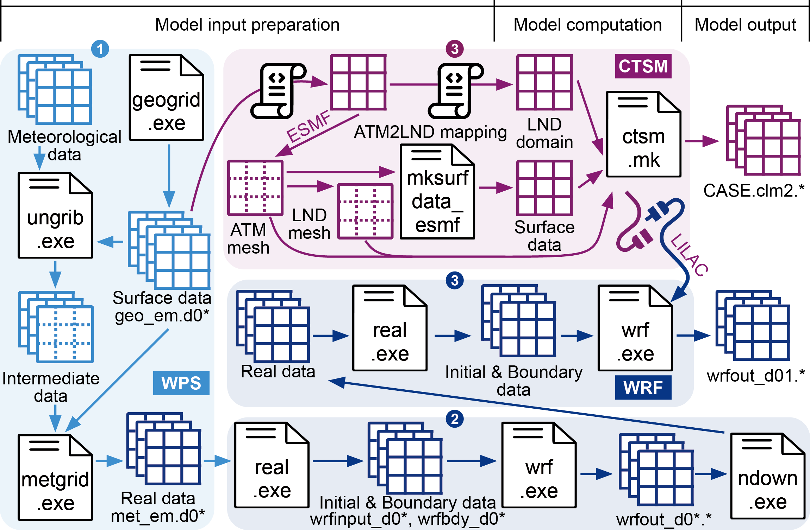

# code_WRF-CLMU

## Introduction

This repository is supplementary to the manuscript "Sun, Y., Oleson, K.W., He, C., & Zheng, Z. (2025). **Advancing CLMU for regional climate simulations through WRF coupling: intercomparison with NOAH–SLUCM**".

The objectives of this project are:

- Develop an urban-focused workflow of WRF-CLMU coupling for regional urban climate simulations;
- Comparatively evaluate two single-layer urban canopy models (i.e., [CLMU](https://doi.org/10.1029/2018MS001586) and NOAH-SLUCM) in an atmosphere-land coupled mode;
- Examine model sensitivity to urban parameters.

## [WRF configuration](./0_WRF-CTSM_configuration)

### [WRF-CLMU](./0_WRF-CTSM_configuration/WRF-CLMU)

- [WRF namelist](./0_WRF-CTSM_configuration/WRF-CLMU/namelist.d04.input.wrf-ctsm)
- [CTSM namelist](./0_WRF-CTSM_configuration/WRF-CLMU/lnd_in)
- [LILAC namelist](./0_WRF-CTSM_configuration/WRF-CLMU/lilac_in)

### [WRF-SLUCM](./0_WRF-CTSM_configuration/WRF-SLUCM)

- [WRF namelist](./0_WRF-CTSM_configuration/WRF-SLUCM/namelist.d04.input.wrf)

### Reference

- [UCAR.CTSM-LILAC User's Guide](https://escomp.github.io/CTSM/lilac/index.html)
- [CTSM-Norway. WRF-CTSM](https://metos-uio.github.io/CTSM-Norway-Documentation/wrf-ctsm/)

## Script and data

### [1_input_data_description](./1_input_data_description/)

- The scripts listed below are used to describe input data and generate plots.

| Num. | Subject                                                      | Data process                                      | Visualization                                                |
| ---- | ------------------------------------------------------------ | ------------------------------------------------- | ------------------------------------------------------------ |
| 1.1  | [Case study area](./1_input_data_description/1.1_case_study_area/) | Use WPS to generate geo domains and surface input | [Figure.ipynb](./1_input_data_description/1.1_case_study_area/Figure.ipynb) |
| 1.2  | [Land surface](./1_input_data_description/1.2_land_surface/) | Use surface input                                 | [Figure.ipynb](./1_input_data_description/1.2_land_surface/Figure.ipynb) |

### [2_simulation_output_analysis](./2_simulation_output_analysis)

- The scripts listed below are used for processing simulation output and visualisation.

| Num. | Subject                                                      | Simulation/Reference data                     | Output data process                                          | Visualization                                                |
| ---- | ------------------------------------------------------------ | --------------------------------------------- | ------------------------------------------------------------ | ------------------------------------------------------------ |
| 2.0  | [Model performance metrics at four sites](./2_simulation_output_analysis/2.0_model_performance_metrics/) | GM_SLUCM, GM_CLMU, In-situ observation        | [Export.ipynb](/2_simulation_output_analysis/2.0_model_performance_metrics/Export.ipynb) | [Figure.ipynb](/2_simulation_output_analysis/2.0_model_performance_metrics/Figure.ipynb) |
| 2.1  | [Model validation at in-situ sites](./2_simulation_output_analysis/2.1_model_validation_in-situ_sites) | GM_SLUCM, GM_CLMU, In-situ observation        | [Export.ipynb](./2_simulation_output_analysis/2.1_model_validation_in-situ_sites/Export.ipynb) | [Figure.ipynb](./2_simulation_output_analysis/2.1_model_validation_in-situ_sites/Figure.ipynb) |
| 2.2  | [Skin temperature map](./2_simulation_output_analysis/2.2_skin_temperature_map/) | GM_SLUCM, GM_CLMU, MODIS, VIIRS               | [Export.ipynb](./2_simulation_output_analysis/2.2_skin_temperature_map/Export.ipynb) | [Figure.ipynb](./2_simulation_output_analysis/2.2_skin_temperature_map/Figure.ipynb) |
| 2.3  | [Skin temperature along the transect](./2_simulation_output_analysis/2.3_skin_temperature_transect/) | GM_SLUCM, GM_CLMU, MODIS, VIIRS               | [Export.ipynb](./2_simulation_output_analysis/2.3_skin_temperature_transect/Export.ipynb) | [Figure.ipynb](./2_simulation_output_analysis/2.3_skin_temperature_transect/Figure.ipynb) |
| 2.4  | [Flux variables](./2_simulation_output_analysis/2.4_flux_variables) | GM_SLUCM, GM_CLMU                             | [Export.ipynb](./2_simulation_output_analysis/2.4_flux_variables/Export.ipynb) | [Figure.ipynb](/2_simulation_output_analysis/2.4_flux_variables/Figure.ipynb) |
| 2.5  | [Sensitivity test on surface energy flux](./2_simulation_output_analysis/2.5_sensitivity_test_flux/) | GM_SLUCM, GM_CLMU, GM_CLMU_ALBE, GM_CLMU_NOAH | [Export.ipynb](./2_simulation_output_analysis/2.5_sensitivity_test_flux/Export.ipynb) | [Figure.ipynb](./2_simulation_output_analysis/2.5_sensitivity_test_flux/Figure.ipynb) |
| 2.6  | [Atmospheric response](./2_simulation_output_analysis/2.6_atmospheric_response/) | GM_SLUCM, GM_CLMU, GM_CLMU_NOAH               | [Export.ipynb](./2_simulation_output_analysis/2.6_atmospheric_response/Export.ipynb) | [Figure.ipynb](./2_simulation_output_analysis/2.6_atmospheric_response/Figure.ipynb) |

### [3_supplementary_information](./3_supplementary_information)

- The scripts listed below are used for processing supplementary information.

| Num. | Subject                                                      | Data process                                                 | Visualization                                                |
| ---- | ------------------------------------------------------------ | ------------------------------------------------------------ | ------------------------------------------------------------ |
| 3.1  | [Model evaluation from Urban-PLUMBER](./3_supplementary_information/3.1_model_evaluation_urban-plumber) | [Export.ipynb](./3_supplementary_information/3.1_model_evaluation_urban-plumber/Export.ipynb) | [Figure.ipynb](./3_supplementary_information/3.1_model_evaluation_urban-plumber/Figure.ipynb) |
| 3.2  | [Computational performance](./3_supplementary_information/3.2_computational_performance/) | [Export.ipynb](./3_supplementary_information/3.2_computational_performance/Export.ipynb) | [Figure.ipynb](./3_supplementary_information/3.2_computational_performance/Figure.ipynb) |

### [4_illustration](./4_illustration/)

- The figures listed below are used to illustrate the details of two models.

| Subject                                               | Visualization                                       |
| ----------------------------------------------------- | --------------------------------------------------- |
| CTSM capability in multi-scale urban climate modeling | [Figure](./4_illustration/ctsm_urban.pdf)           |
| Urban representation in land surface models           | [Figure](./4_illustration/urban_representation.pdf) |
| General workflow of coupling WRF and CTSM             | [Figure](./4_illustration/couple_wrf-ctsm.pdf)      |
| Atmosphere-land coupling                              | [Figure](./4_illustration/vertical_coupling.pdf)    |
| Factors contributing to simulation differences        | [Figure](./4_illustration/model_difference.pdf)     |

## Acknowledgements

- This work was supported by the Natural Environment Research Council [grant number UKRI1294].
- This work used the [ARCHER2 UK National Supercomputing Service](https://www.archer2.ac.uk) and [JASMIN, the UK’s collaborative data analysis environment](https://www.jasmin.ac.uk).
- [Z. Z.](https://github.com/zhonghua-zheng) appreciates the support provided by the academic start-up funds from the Department of Earth and Environmental Sciences at The University of Manchester.
- [Y. S.](https://github.com/YuanSun-UoM) is supported by the PhD studentship of [Z. Z.](https://github.com/zhonghua-zheng)'s academic start-up funds.
- The authors declare no conflict of interest.
- NSF National Center for Atmospheric Research is a major facility sponsored by the U.S. National Science Foundation under Cooperative Agreement No. 1852977.